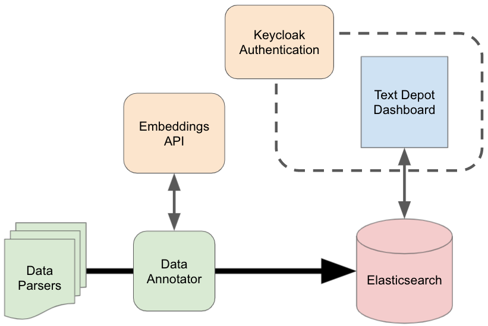

Text Depot is a tool to search and analyze topics of interest within a large database of text data. The Text Depot dashboard (this repo) provides a front-end to a set of indexes in ElasticSearch. To use this repository, you must provide one or more [Elastic Search](http://www.elastic.co) indexes in a particular format.

## Local Machine Setup

1. Clone this repo.
2. Run `cp .configs_sample .configs` and fill in the relevant values.

### Running Locally

1. Install any missing libraries with `install.packages("DT")` (for example). A list of required libraries can be found in the included `Dockerfile`
2. Run `Rscript run_text_depot_dashboard.R`

### Running via Docker

1. Optionally, create a `.dockerignore` file to exclude any local files.
2. Use the provided `Dockerfile` to build and run the app:

```
$ DOCKER_BUILDKIT=1 docker build -t text_depot_dashboard .
$ docker run -it -p 8080:3838 text_depot_dashboard
```

3. Open the dashboard on your browser: [http://localhost:8080](http://localhost:8080)

## ElasticSearch

Each data source should be stored in its own Elastic Search index. For more information, see [elasticsearch/](elasticsearch/)

## Notes

Our workflow contained the following components:



This repository contains the dashboard code (Blue above) for Text Depot. The green components were scheduled with cron jobs, and keep the indexes up-to-date in the ElasticSearch Database. We wrote a custom Parser for each data source, and a single Annotator class that adds the fields below to each document before insertion. The orange components were added for authentication and embeddings-based search, and are optional components. 

